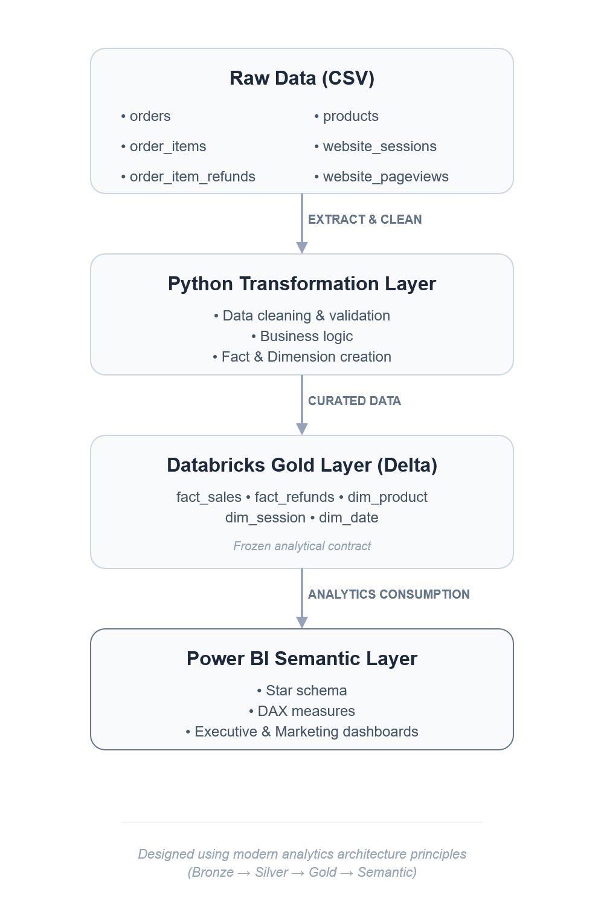
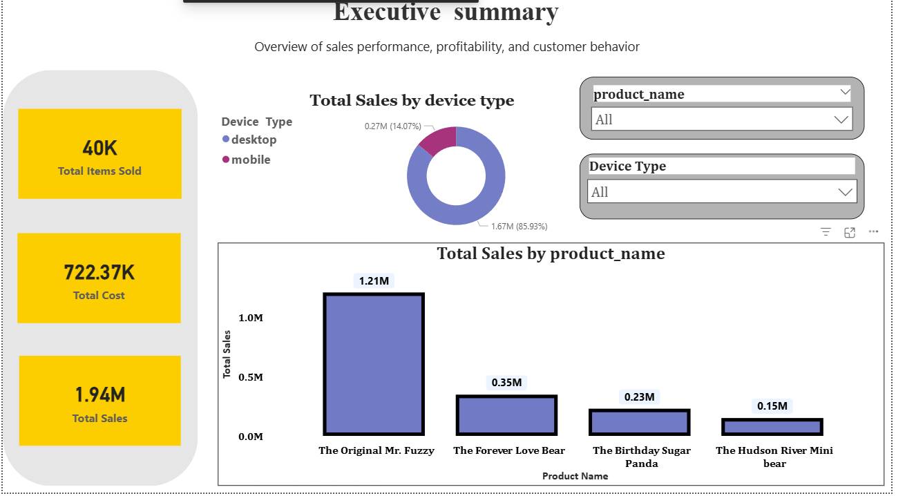
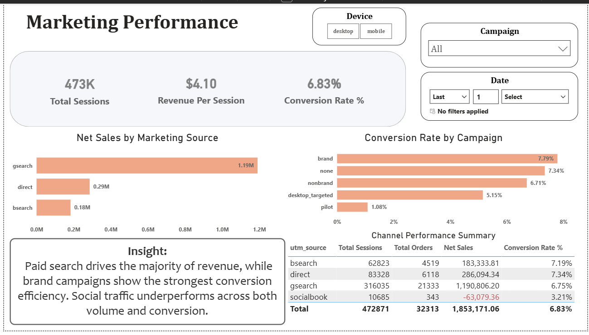

# 📊 End-to-End Sales & Marketing Analytics  
## Maven Fuzzy Factory (E-Commerce)


---

## 📌 Project Overview

This project implements a **modern, industry-style analytics pipeline** for **Maven Fuzzy Factory**, an e-commerce retailer selling teddy bear products online.

Raw transactional and marketing data is transformed into a **clean analytical model** and visualized through **Power BI dashboards** to support executive, marketing, and product-level decision-making.

The focus of this project is **analytics engineering, data modeling, and business insight generation** — not just dashboard creation.

---

## 🎯 Business Objectives

- Create a **single source of truth** for sales and marketing analytics  
- Evaluate **marketing channel and campaign effectiveness**  
- Analyze **product performance and refund impact**  
- Enable **time-based and device-based analysis**  
- Deliver **executive-ready dashboards**  

---

## 🧱 Architecture



**Data Flow:**

```text
Raw CSV Data
   ↓
Python (Cleaning & Validation)
   ↓
Databricks Community Edition (Delta Gold Layer)
   ↓
Power BI (Semantic Model & Dashboards)
```

---

## ⭐ Data Model (Star Schema)


**Fact Tables**
- `fact_sales` — one row per order item
- `fact_refunds` — one row per refunded order item

**Dimension Tables**
- `dim_product`
- `dim_session`
- `dim_date`

**Modeling Principles**
- Star schema design
- Single-direction relationships
- No fact-to-fact relationships
- All business logic implemented as **DAX measures**

---

## 📊 Dashboards

### 🔹 Executive Overview


Provides a high-level snapshot of:
- Net Sales
- Orders & Items Sold
- Profit Margin
- Conversion Rate
- Sales by Product and Device

---

### 🔹 Marketing Performance


Analyzes:
- Website sessions, conversion rate, and revenue per session
- Performance by UTM source and campaign
- Device-level segmentation

---

Highlights:
- Product-level revenue
- Refund amounts and refund rates
- Identification of high-risk products

---

## 📐 Key KPIs

- Total Sales  
- Net Sales  
- Total Orders  
- Total Items Sold  
- Total Sessions  
- Conversion Rate %  
- Revenue per Session  
- Total Refunds  
- Refund Rate %  
- Profit Margin %  

Detailed KPI definitions are documented in  
📄 `documentation/KPIs.md`

---

## ▶️ How to Run This Project

This project is designed as a **portfolio analytics project**.  
The steps below describe how the analysis was executed and how it can be reproduced at a high level.

### Prerequisites
- Python 3.9+
- Databricks Community Edition account
- Power BI Desktop

### Steps

1. **Data Preparation (Python)**
   - Raw CSV files are placed in `data/raw/`
   - Python notebooks in `notebooks/` perform:
     - Data cleaning
     - Validation
     - Creation of curated fact and dimension tables
   - Outputs are saved to `data/processed/`

2. **Gold Layer (Databricks)**
   - Processed CSVs are uploaded to Databricks Community Edition
   - Tables are converted to managed Delta tables
   - This layer is treated as a frozen analytical contract

3. **Semantic Layer & Dashboards (Power BI)**
   - Power BI connects to Databricks using the native connector
   - A star schema model is created
   - DAX measures are implemented for all KPIs
   - Dashboards are built for executive, marketing, and product analysis

### Notes
- Power BI `.pbix` files are not included to avoid large binaries
- Dashboard screenshots and data model images are provided instead
- The project emphasizes analytics design over automated deployment

---

## 🛠 Tools & Technologies Used

- 🐍 **Python** — data cleaning and transformation  
- ⚡ **Databricks Community Edition** — Delta Gold layer  
- 📊 **Power BI Desktop** — semantic modeling and dashboards  
- 🧮 **DAX** — KPI and business logic  
- 🗂 **GitHub** — version control and portfolio hosting  

---

## 📂 Repository Structure

``` Text
Sales Analytics/
│
├── architecture/
│ ├── high_level_architecture.png
│ ├── data_model.png
│ └── dashboards/
│
├── data/
│ ├── raw/
│ └── processed/
│
├── notebooks/
│ ├── python_eda.ipynb
│ └── python_data_cleaning.ipynb
│
├── powerbi/
│ └── pbix/ (ignored in git)
│
├── documentation/
│ ├── business_requirements.md
│ ├── data_dictionary.md
│ ├── KPIs.md
│ └── project_report.md
│
└── README.md
```

---

## 📘 Documentation

- 📄 **Business Requirements** — `documents/business_requirements.md`
- 📄 **Data Dictionary** — `documents/data_dictionary.md`
- 📄 **KPI Definitions** — `documents/KPIs.md`
- 📄 **Project Report** — `documents/project_report.md`

---

## 🚧 Limitations & Future Enhancements

### Current Limitations
- Static historical dataset
- Import-based Power BI refresh
- Databricks Community Edition constraints

### Future Enhancements
- Migration to Azure Databricks and Data Lake
- Automated refresh pipelines
- Customer lifetime value and cohort analysis
- DirectQuery support in Power BI

---

## ✅ Key Takeaways

- Implemented **industry-grade star schema modeling**
- Clearly separated Bronze → Silver → Gold → Semantic layers
- Modeled refunds correctly as a secondary fact
- Built dashboards focused on **business decisions**, not visuals alone

---

📌 *This project demonstrates practical analytics engineering and BI skills aligned with real-world data teams.*


